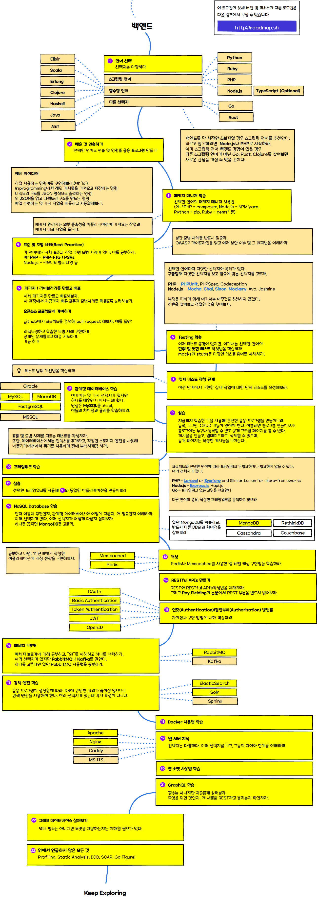
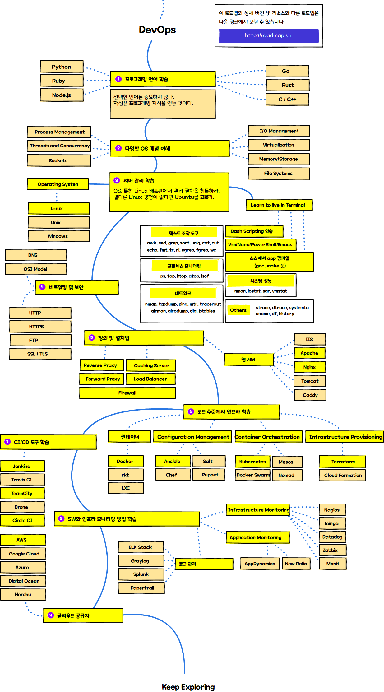

> 웹 개발자 로드맵(ver. 2020)

아래에는 프론트엔드/백엔드/데브옵스가 되기 위해 취할 수 있는 경로와 채택할 기술을 보여 주는 차트가 있다. 이 차트는 대학생들과 공유할 수 있는 것을 원했던 교수를 위해 만들었다. 커뮤니티를 돕고자 이를 여기에 공유한다.

***

<b> 🎉 이 로드맵의 확장 버전을 작업중이다 🎉 </b> Keep your eyes on <a href="http://roadmap.sh">roadmap.sh</a> for the updates!

***

<h3 align="center"><strong>로드맵의 목적</strong></h3>

> 로드맵의 목적은 혼란스러울 때 큰 그림을 보여주고 후속 공부 주제를 안내하는 것이지, 유행을 따르게 하는 것은 아니다. 각 경우에 한 기술이 왜 다른 것보다 적합한지 이해하고, 기술이 유행한다고 최적은 아님을 명심해야 한다.

<h3 align="center"><strong>초보자에게 알림</strong></h3>

> 이 로드맵은 아래에 나열된 경로에 대해 배울 수 있는 모든 내용을 담고 있다. 양에 압도당하지 말라. 막 시작했다면 모두를 시작부터 배울 필요는 없다. 초보자 버전은 현재 작업중이며, 2020년 백엔드 및 데브옵스 로드맵이 완성되면 곧 공개할 것이다.

***

어떤 방식으로든 개선점이 있다면 알려달라.

## Introduction

## 프론트엔드 로드맵

 

## 백엔드 로드맵

 

## 데브옵스(DevOps) 로드맵

 

## 🚦 마무리

로드맵을 개선할 수 있겠다면 issue에서 자유롭게 토론해달라. 또한, 이것을 계속 개선할 것이므로, 이 리포지토리를 보거나 [roadmap.sh](http://roadmap.sh)에서 구독하여 다시 방문할 수 있다.

## 🙌 기여

> 로드맵이 어떻게 업데이트 되었는지를 보고 싶으면 [contribution docs](./contributing.md)을 보라

- Open pull request with improvements
- 아이디어는 issues에서 토론하라
- Spread the word
- Reach out with any feedback 
 
## 라이센스

자세한 사항은 [license file](./license.md)을 참조하라.